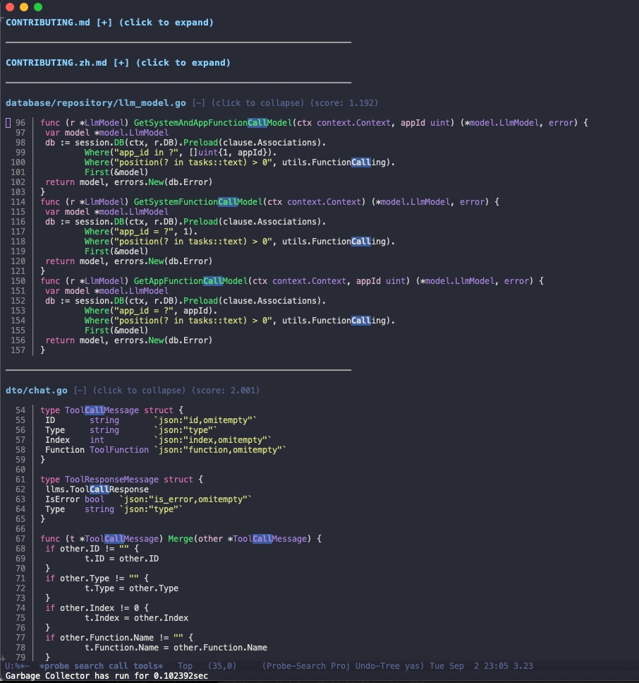

# probe.el

AI-friendly, fully local semantic code search for Emacs powered by [probe](https://github.com/probelabs/probe).

## Features

- **Semantic Code Search**: Search through code understanding its structure and meaning
- **AST-based Queries**: Query code using Abstract Syntax Tree patterns
- **Project-Aware**: Automatically detects and searches within project boundaries
- **Enhanced UI**: Syntax highlighting and intuitive result navigation with file collapse/expand capabilities
- **Fast & Local**: No cloud dependencies, all processing happens locally
- **Test Filtering**: Option to include/exclude test files from results
- **Comprehensive Testing**: Built-in test suite for syntax highlighting and search functionality
- **Robust Error Handling**: Enhanced error handling throughout the codebase
- **Advanced Syntax Highlighting**: Word boundary matching for precise search term highlighting

## Screenshots



## Requirements

- Emacs 26.1 or higher
- [probe](https://github.com/probelabs/probe) command-line tool installed
- `s.el` string manipulation library

## Installation

### Manual Installation

1. Clone this repository:
```bash
git clone https://github.com/edmondfrank/probe.el.git
```

2. Add to your Emacs configuration:
```elisp
(add-to-list 'load-path "/path/to/probe.el")
(require 'probe-search)
```

## Usage

### Interactive Commands

- `M-x probe-search` - Perform text-based semantic search
- `M-x probe-query` - Execute AST-based structural queries
- `M-x probe-query-method` - Search for methods by name
- `M-x probe-query-class` - Search for classes by name
- `M-x probe-query-function` - Search for functions by name
- `M-x probe-search-menu` - Open interactive configuration menu

### Key Bindings in Results Buffer

| Key   | Action                     |
|-------|----------------------------|
| `RET` | Visit result at point      |
| `g`   | Restart current search     |
| `q`   | Quit search window         |
| `n`   | Next result                |
| `p`   | Previous result            |
| `s`   | Start new text search      |
| `a`   | Start new AST query        |
| `t`   | Toggle test file inclusion |
| `TAB` | Toggle file section visibility |

### Example Searches

#### Text Search
```
M-x probe-search RET
Search query: authentication middleware
```

#### AST Queries
```
M-x probe-query RET
AST query: class::*Controller*
```

```
M-x probe-query-function RET
Function name: handle*
```

## Configuration

### Basic Configuration

```elisp
(use-package probe-search
  :ensure t
  :bind (("C-c s s" . probe-search)
         ("C-c s q" . probe-query)
         ("C-c s m" . probe-query-method)
         ("C-c s c" . probe-query-class)
         ("C-c s f" . probe-query-function))
  :config
  (setq probe-search-command "probe"
        probe-search-use-project-root t
        probe-search-include-tests nil
        probe-search-max-results 100))
```

### Customization Options

| Variable                               | Default                          | Description                                           |
|----------------------------------------|----------------------------------|-------------------------------------------------------|
| `probe-search-command`                 | `"probe"`                        | Path to probe executable                              |
| `probe-search-use-project-root`        | `t`                              | Search from project root instead of current directory |
| `probe-search-include-tests`           | `nil`                            | Include test files in search results                  |
| `probe-search-max-results`             | `nil`                            | Maximum number of results (nil for unlimited)         |
| `probe-search-display-buffer-function` | `'switch-to-buffer-other-window` | Function to display results buffer                    |

### Face Customization

```elisp
;; Customize appearance
(set-face-attribute 'probe-search-filename-face nil
                    :foreground "blue"
                    :weight 'bold)

(set-face-attribute 'probe-search-match-face nil
                    :background "yellow"
                    :foreground "black")

(set-face-attribute 'probe-search-line-number-face nil
                    :foreground "gray60")
```

## Advanced Features

### Enhanced UI Mode

The package includes an optional enhanced UI with syntax highlighting:

```elisp
;; Enable enhanced UI (automatically loaded if available)
(require 'probe-search-enhanced)
```

### File Navigation and Collapse

Search results now include advanced file management features:

- **File Collapse/Expand**: Press `TAB` to collapse or expand individual file sections
- **Visual Indicators**: Collapsed files show `[+]` indicator with click-to-expand functionality
- **Persistent State**: File collapse state is maintained during search sessions
- **Improved Navigation**: Enhanced result traversal with better visual feedback

### Testing Capabilities

The package includes comprehensive test functions to verify functionality:

```elisp
;; Test search term highlighting
M-x probe-search--test-highlight-matches RET

;; Test syntax highlighting (if enhanced UI available)
M-x probe-search--test-apply-syntax-highlighting RET
```

Built-in test functions:
- **`probe-search--test-highlight-matches`** - Tests word boundary matching for search term highlighting
- **`probe-search--test-apply-syntax-highlighting`** - Tests syntax highlighting functionality

### Project Integration

probe.el automatically integrates with Emacs project.el to detect project boundaries:

- Uses `project-root` when available
- Falls back to git repository root
- Defaults to current directory if no project detected

### Custom Display Function

```elisp
;; Display results in current window
(setq probe-search-display-buffer-function 'switch-to-buffer)

;; Display in a side window
(setq probe-search-display-buffer-function
      (lambda (buffer)
        (display-buffer buffer
                        '(display-buffer-in-side-window
                          (side . right)
                          (window-width . 0.5)))))
```

## Troubleshooting

### Probe command not found

Ensure probe is installed and in your PATH:

```bash
which probe
```

Or set the full path:

```elisp
(setq probe-search-command "/usr/local/bin/probe")
```

### No results found

1. Check if you're in the correct project directory
2. Try toggling test file inclusion with `t`
3. Verify probe works from command line:
   ```bash
   probe search "your query" /path/to/project
   ```

### Performance issues

Limit the number of results:

```elisp
(setq probe-search-max-results 50)
```

### Error handling

The package includes robust error handling for common issues:

- **JSON parsing errors**: Detailed error messages with output preview
- **Process errors**: Clear indication when probe command fails
- **Missing dependencies**: Helpful messages when required tools are not found

If you encounter errors, check the search results buffer for detailed error messages that can help diagnose the issue.

## Contributing

Contributions are welcome! Please:

1. Fork the repository
2. Create a feature branch (`git checkout -b feature/amazing-feature`)
3. Commit your changes (`git commit -m 'Add amazing feature'`)
4. Push to the branch (`git push origin feature/amazing-feature`)
5. Open a Pull Request

### Development Setup

```bash
# Clone repository
git clone https://github.com/edmondfrank/probe.el.git
cd probe.el

# Install dependencies
make deps

# Run tests
make test

# Run linting
make lint
```

### Testing

The package includes built-in test functions for development and verification:

#### Running Tests

```elisp
;; Test search term highlighting functionality
M-x probe-search--test-highlight-matches

;; Test syntax highlighting (requires enhanced UI)
M-x probe-search--test-apply-syntax-highlighting
```

#### Test Coverage

- **Search highlighting**: Tests word boundary matching and case-insensitive search
- **Syntax highlighting**: Tests code syntax highlighting for various languages
- **Error handling**: Tests robust error handling for malformed input
- **File operations**: Tests file collapse/expand functionality

#### Custom Testing

You can add your own test cases by extending the existing test functions:

```elisp
(defun my-probe-search-test ()
  "Custom test for probe search functionality."
  ;; Add your test cases here
  )
```

## License

This project is licensed under the GNU General Public License v3.0 - see the [LICENSE](LICENSE) file for details.

## Acknowledgments

- [probe](https://github.com/probelabs/probe) - The underlying search engine
- Emacs community for feedback and contributions
